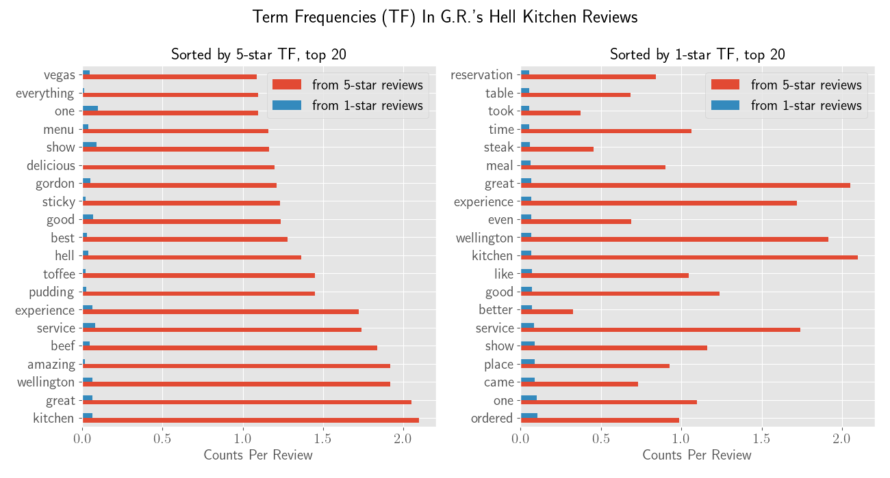

# Insights from Restaurant Reviews
## Overview of Repository
Using real-world data released by [Yelp](https://www.yelp.com/dataset/challenge), this project has accomplished the following for
*restaurants in Las Vegas*.

1. Loading JSON files efficiently by chunking and early down-filtering. Published methodology on [Towards Data Science](https://towardsdatascience.com/load-yelp-reviews-or-other-huge-json-files-with-ease-ad804c2f1537).
2. Logistic regression & naive Bayes models for sentiment analysis (+ve *vs* -ve sentiment)
3. Collaborative filtering and [matrix factorization](http://www.albertauyeung.com/post/python-matrix-factorization/) recommenders for restaurants.
4. Topic & keyword discovery from a large set of reviews, with two restaurants serving as spotlights.

To try out this repository, either
- Place JSON files from Yelp into the directory `yelp_dateset`, and then run `Preprocessing.ipynb`;
- OR, start from any notebook of interest, which ingests preprocessed data from the `data` directory.

## Technologies & Libraries Used
Python 3.7 & 3.8, [pandas](https://pandas.pydata.org/) 0.23 & 1.2, [scikit-learn](http://scikit-learn.org/), [scikit-surprise](http://surpriselib.com/). As of late 2018, `scikit-surprise` may be the only single-machine Python library that accounts for [user/item biases](https://surprise.readthedocs.io/en/stable/matrix_factorization.html#surprise.prediction_algorithms.matrix_factorization.NMF) in explicit ratings.

## Summary of Jupyter Notebooks and Results
### `SentimentAnalysis_Search.ipynb`
1. Removed stop words from reviews based on term/document frequency, and then transformed reviews into TF-IDF vectors of unigrams. 
2. Trained and cross-validated logistic regression and naive Bayes classifiers. 
3. Built a search engine for (vectorized) reviews based on cosine similarity, which enables quick discovery of reviews with possibly similar themes.

Binary classification targets for 2) came from the rating (1 to 5, integer, inclusive) attached to each review. A rating of 5 is taken to indicate "perfectness", while any lower rating is taken to indicate the country. The labels thus obtained are almost balanced, and both logistic regression and naive Bayes managed to achieve +0.8 accuracy, prediction, and recall on held-out test data.

In comparison, state-of-the-art deep (SOTA) learning models in 2018 [achieved](https://blog.paralleldots.com/data-science/breakthrough-research-papers-and-models-for-sentiment-analysis/)) 0.9+ accuracy on IMDB benchmark data, which is of a similar size to the Yelp data used in this project. Therefore, I think it is amazing that simple, linear models can achieve near-SOTA performance, and that it may not be worthwhile to implement models that are harder to interpret and computationally more intensive.

All machine learning models were implemented through [scikit-learn](http://scikit-learn.org/).

### `Build-Recommender.ipynb`, `src/Recommender.py`
1. Constructed and evaluated collaborative filtering (CF) and [non-negative matrix factorization (NMF)](http://www.albertauyeung.com/post/python-matrix-factorization/) recommenders for restaurants.

Both recommenders utilize information from the same utility matrix, which records user preference for each item (restaurant). Here I used the 1-5 star ratings attached to each review as a proxy for preference, and demonstrated an extension by incorporating the number of useful votes received by each review.

To evaluate the CF recommender, I compared the top recommendations for randomly selected users with restaurants they have already reviewed. The idea is that the two sets of restaurants should be similar in identifiable ways, e.g. offering the same cuisine and food items which are then mentioned in reviews. A more rigorous performance evaluation would, say, involve comparing the click-through rate of CF *v.s.* random recommendations.

To evaluate the NMF recommender, I have utilized [scikit-surprise](http://surpriselib.com/)'s built-in functionality for measuring performance: by masking some non-zero entries in the utility matrix and let the trained model "predict" them, the library calculated a RMSE which serves as a measure for the quality of recommendations. Here I achieved a RMSE of 1.2, compared to ~0.89 by the winner of the legendary [Netflix competition](https://netflixtechblog.com/netflix-recommendations-beyond-the-5-stars-part-1-55838468f429).

Item-item CF is implemented using custom code, while NMF functionality is provided by [scikit-surprise](http://surpriselib.com/). 

### `TopicDiscovery.ipynb`
1. Applied bag-of-word techniques to extract and visualize diners' thoughts on two famous restaurant franchises: McDonald's and Gordon Ramsay Hell's Kitchen. 

For each restaurant, I extracted the twenty most frequent words (unigrams) from 1-star and 5-star reviews, *respectively*, and then plotted the two sorted word sets side-by-side. That way we can quickly see which words are the most prominent among positive and negative reviews, respectively, for a single restaurant. 

This approach is demonstrated below for Gordon Ramsay Hell's Kitchen. For example, we can see that "service" is among the top words for both 1-star and 5-star reviews, pointing to possibly polarizing opinion on the restaurant's service standard.

